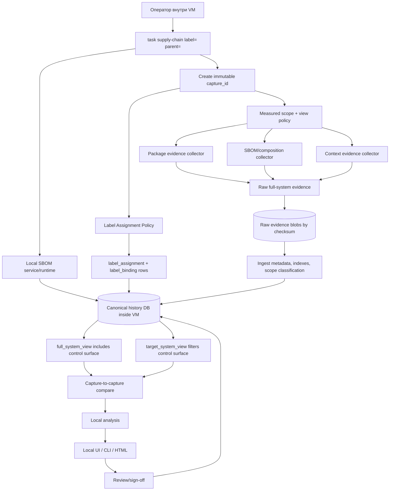
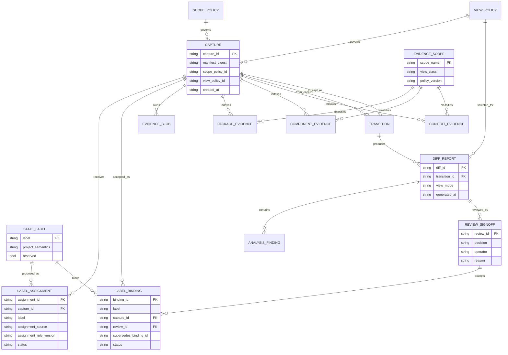
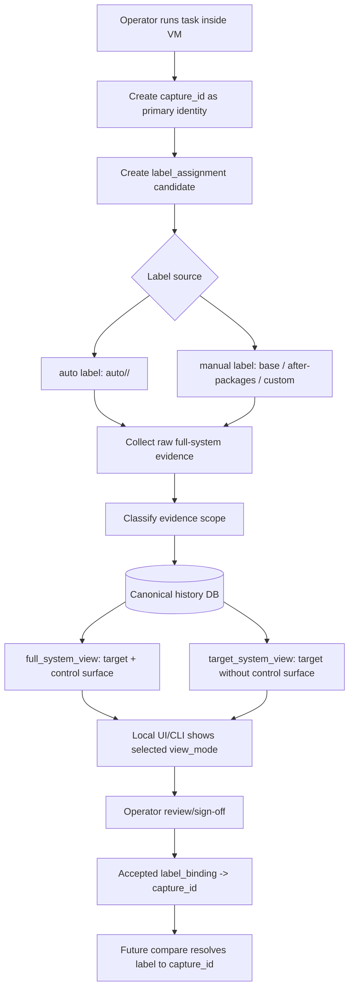

# BOOT-011: финальная архитектура in-VM Supply Chain контура

## Назначение

Этот документ фиксирует финальное архитектурное решение для `BOOT-011`.
Сравнение вариантов завершено; дальше этот документ является входом для
реализационной задачи.

Финальная архитектура:

- работает целиком внутри VM;
- хранит историю SBOM и связанных evidence в БД;
- дает оператору локальный UX внутри VM;
- не экспортирует данные наружу как часть core workflow;
- не сводит SBOM к package list;
- не смешивается с provisioning playbook `workstation`;
- устраняет split source-of-truth через одну authoritative DB;
- использует `capture_id` как primary identity;
- хранит labels как DB-backed bindings к captures;
- использует dual-view модель для SBOM control surface.

Входные исследования, на которые опирается решение:

- `docs/research/2026-04-25-supply-chain-sbom-tooling-research.md`
- `docs/research/2026-04-25-canvas-ux-tooling-research.md`
- `docs/research/2026-04-26-supply-chain-reference-implementations-research.md`

## Final architecture choice

Принята архитектура: **in-VM Local SBOM Service with Canonical History DB**.

Это service-oriented in-VM контур, близкий к прежнему Variant 2, но без его
главного дефекта: нет sidecar ledger и нет split source-of-truth. Одна локальная
authoritative DB хранит captures, label assignments, accepted label bindings,
evidence metadata, component model, view policies, diffs, analysis findings и
review/sign-off.

Локальный SBOM service может быть реализован на базе Dependency-Track/SBOMHub-
style подхода или собственного минимального service/runtime, но архитектурный
contract важнее конкретного продукта:

- DB живет внутри VM;
- service/UI работает внутри VM;
- `capture_id` создается автоматически для каждого collection run;
- raw evidence blobs являются payload by checksum;
- label assignment и label binding являются DB records, а не именами файлов;
- full/filtered views являются DB-defined projections;
- reports и UI являются projections;
- review/sign-off driven by DB state.

Почему выбран этот вариант:

- он ближе всего к требованию operator UX inside VM;
- он DB-backed с первого дня;
- он поддерживает историю `base`, `after-packages` и следующих states;
- он не зависит от outside-VM export/publish;
- он явно разделяет package evidence, composition evidence и diff/report
  evidence;
- он устраняет ambiguity вокруг labels через append-only bindings;
- он устраняет ambiguity вокруг SBOM control surface через dual-view evidence
  policy;
- он лучше, чем embedded DB-only подход, потому что сразу проектирует локальную
  visualization and review surface;
- он проще и реалистичнее, чем graph-first архитектура, потому что graph model
  можно добавить позже как projection/query layer.

Почему остальные варианты не выбраны сейчас:

- Embedded History DB без service UI не выбран как baseline, потому что
  оператору нужен локальный контур просмотра, анализа и review внутри VM, а не
  только DB плюс generated reports.
- Local Graph Workspace не выбран сейчас, потому что graph-first model слишком
  тяжел для первого внедрения и требует query/schema discipline до того, как
  базовая DB-backed SBOM history будет проверена.
- Ledger-only/files-first подход запрещен как baseline: он не решает достаточно
  строго persistence boundary, immutable accepted baselines, label assignment и
  operator UX.

## Закрытие review findings

| Finding | Архитектурное закрытие |
|---|---|
| `snapshot rollback breaks local history model` | History DB живет на отдельной persistent storage boundary, не входящей в measured rollback scope. Rollback/re-entry создает новый immutable capture и не переписывает accepted baseline. |
| `state labels are not anchored to immutable accepted baselines` | Labels `base`, `after-packages` и следующие labels являются append-only bindings к immutable `capture_id`. Compare всегда резолвит label в accepted binding. |
| `measured scope is too soft and allows self-contamination` | Measured scope policy является DB-backed версионированным contract. Raw evidence собирается полно, но target compare/report работают через filtered view, где SBOM control surface и runtime data исключены по policy. |
| `variant 2 has unresolved split source-of-truth problem` | Split source-of-truth устранен: authoritative source один, local service history DB. Raw blobs, reports, UI and diagrams are derived/payload surfaces. |

## Жесткие инварианты

- `in-VM only`: collection, persistence, compare, analysis, visualization and
  review happen inside VM.
- No mandatory outside-VM export/sync/publish.
- No clone/delete-centric design.
- DB-backed history is mandatory.
- Operator UX is inside VM: localhost UI, CLI/TUI, or local HTML generated from
  DB.
- SBOM is composition evidence, not package inventory.
- Package evidence, SBOM/composition evidence and diff/report evidence are
  separate evidence classes.
- `capture_id` is primary identity.
- Labels are aliases/bindings, not proof and not identity.
- SBOM control surface is monitored in raw/full evidence.
- Target-system compare/report uses filtered view policy, not modified source
  truth.
- Provisioning roles do not know about supply-chain state.
- The source of truth is one authoritative DB.

## Architecture Overview



## History persistence boundary

History store lives inside VM, but outside target-system measured state:

```text
/var/lib/bootstrap-supply-chain/
  db/
    history.db
  evidence/
    blobs/sha256/<digest>
  reports/
  ui/
  runtime/
  cache/
```

Physical/logical placement:

- `/var/lib/bootstrap-supply-chain/db/history.db` is the canonical DB.
- `/var/lib/bootstrap-supply-chain/evidence` stores raw payloads by checksum.
- `/var/lib/bootstrap-supply-chain/reports` and `/ui` store derived local views.
- `/var/lib/bootstrap-supply-chain/runtime` and `/cache` are runtime surfaces.
- The tree is part of the SBOM control/storage surface, not part of the
  target-system comparison view.

Persistence requirement:

- this tree must be on a persistent storage boundary that survives rollback or
  re-entry into `base`;
- if the runtime cannot verify that boundary, collection must fail early;
- the DB must never be created in a rollback-prone target measured path
  silently;
- rollback/re-entry cannot delete accepted history because accepted history is
  stored in the persistent DB boundary, not in the transient snapshot state.

How history survives state transitions:

- every collection creates an immutable `capture_id`;
- labels bind to accepted captures, not to the current filesystem state;
- label assignment and rebinding are append-only DB records;
- transitions are DB records between captures;
- rollback/re-entry creates a new capture candidate and does not overwrite
  accepted history;
- equivalent captures may be marked equivalent by digest, but remain distinct
  DB records.

Measured system state:

- selected filesystem scan roots;
- installed software composition;
- package manager state;
- selected OS/runtime/config context defined by profile;
- SBOM control-surface software components in `full_system_view`.

SBOM runtime/storage surface:

- canonical DB;
- raw evidence blob store;
- local service runtime;
- scanner/tool cache;
- local UI assets;
- generated reports;
- vulnerability/cache data.

Runtime/storage data is not treated as target-system composition. The packages,
executables and dependencies that implement the SBOM contour are still captured
as control-surface evidence in raw/full-system evidence.

## Immutable state identity

Human labels are not identity. Immutable captures are identity.

| Entity | Purpose | Mutability |
|---|---|---|
| `capture_id` | Immutable identity of one evidence collection. | Created automatically; never changes. |
| `state_label` | Human project label, such as `base` or `after-packages`. | Alias only; never owns evidence. |
| `label_assignment` | Proposed auto/manual label association for a capture. | Append-only; may become accepted/rejected. |
| `label_binding` | Accepted mapping from label to capture. | Append-only; superseded, not overwritten. |
| `transition_id` | Immutable relation between two captures. | Never changes. |
| `review_id` | Operator decision over capture/diff/analysis/label. | Append-only. |

`capture_id` is derived from or references a capture manifest that includes:

- scope policy version;
- view policy version;
- scanner/tool versions;
- package evidence digest;
- SBOM/composition evidence digest;
- context evidence digest;
- scan roots/excludes digest;
- control-surface classification digest;
- parent capture, if provided;
- host metadata and timestamp as metadata, not semantic identity.

How `base` is anchored:

- first accepted `base` collection creates `capture_id`;
- `state_label=base` is initially a candidate assignment;
- operator review accepts the binding from `base` to that `capture_id`;
- future re-entry into `base` creates another capture candidate;
- accepted `base` binding does not change without explicit baseline
  re-acceptance and rebinding reason.

How `after-packages` is anchored:

- collection after package-management roles creates a new immutable
  `capture_id`;
- transition is recorded from accepted `base` capture;
- `state_label=after-packages` is initially a candidate assignment;
- operator review binds `after-packages` to the accepted capture.

Silent relabel/reuse is impossible by contract:

- labels are not used as primary keys for evidence;
- labels are not evidence of state by themselves;
- capture-to-capture compare resolves labels through accepted bindings;
- rebinding a label creates a new binding record with review id, operator,
  timestamp and reason;
- old bindings are superseded, not updated in place.

## Label Assignment Policy

`capture_id` is created automatically for every collection run before evidence
ingest starts. `capture_id` is the primary identity for captures, evidence,
diffs, reports and reviews.

`state_label` is an alias/binding to a capture. A label can be created in two
ways:

- automatically by service rule;
- manually by operator request.

Who assigns labels:

- `supply_chain_capture` always creates the immutable `capture_id`;
- `supply_chain_label_bind` records label assignment candidates in DB;
- the local service may propose automatic labels;
- the operator may request manual labels through task vars or local UI;
- `supply_chain_review` is the only module that can accept, reject or supersede
  a binding.

Automatic label assignment:

- if `supply_chain_label` is omitted, the service creates a candidate label such
  as `auto/<utc-timestamp>/<short-capture-id>`;
- if the run is attached to a known parent label, the service may also propose a
  semantic candidate such as `next-after-<parent>/<sequence>`;
- automatic labels are useful for traceability, but they are not accepted
  baselines until review;
- automatic assignment stores `assignment_source=auto`, `assignment_rule_id`,
  `assignment_rule_version`, proposed label, capture id, parent resolution,
  timestamp and status.

Manual label assignment:

- if `supply_chain_label` is provided, the requested label is stored as a
  candidate assignment with `assignment_source=manual`;
- reserved project labels such as `base` and `after-packages` require explicit
  operator confirmation during review;
- manual assignment stores requested label, requested operator/context,
  capture id, parent resolution, timestamp, status and optional reason.

Accepted binding policy:

- `base`, `after-packages` and later project labels are bindings to captures,
  not proof of state by themselves;
- compare never operates on a label string directly;
- compare first resolves every label to its current accepted `label_binding`;
- compare records both the label used by the operator and the resolved
  `capture_id`;
- review/sign-off is attached to `capture_id`, diff/report rows and accepted
  label binding.

Rebinding policy:

- rebinding is deny-by-default for reserved labels unless the operator performs
  explicit review action;
- rebinding never updates the old row in place;
- a new `label_binding` row is created with `supersedes_binding_id`,
  `review_id`, operator, timestamp and reason;
- old bindings remain queryable for audit and historical reports;
- if two accepted bindings conflict for the same active label without an
  explicit supersession chain, the DB state is invalid and compare/review must
  fail closed.

## Measured scope policy

Measured scope policy is a hard DB-backed contract. Every capture references one
policy version. Captures without verified policy are invalid.

The architecture uses two DB-defined views over the same raw evidence:

- `full_system_view`: complete auditable software view, including SBOM
  control-surface packages/components where they are discoverable.
- `target_system_view`: project target-system view used for ordinary
  `base -> after-packages -> next state` compare, excluding SBOM
  control-surface components and runtime data by policy.

Included in raw/full-system evidence:

- selected rootfs/filesystem scan roots;
- discovered software components from SBOM generator;
- package manager evidence as separate package evidence;
- SBOM service, scanner, runtime, UI packages and their dependencies when they
  are installed on the VM and visible to package/composition collectors;
- component metadata, file ownership hints, licenses and generated metadata
  where available;
- selected OS/runtime/config context only when included by profile.

Excluded from target-system compare/report view:

- `/var/lib/bootstrap-supply-chain`;
- local SBOM service runtime data and DB files;
- scanner/toolchain runtime data;
- scanner caches and vulnerability DB caches;
- generated reports and UI assets;
- SBOM control-surface components classified by policy;
- `/proc`, `/sys`, `/dev`, `/run`, `/tmp`;
- external/runtime mounts not explicitly included by policy.

Self-contamination prevention:

- `supply_chain_scope_guard` verifies scope and view policy before collection;
- scanner commands receive scan roots/excludes from the DB policy, not ad hoc
  variables;
- raw package evidence may include SBOM control-surface packages, but they must
  be classified as `control_surface`;
- raw composition evidence may include SBOM control-surface components, but they
  must be classified as `control_surface`;
- target-system diff/report rejects unclassified control-surface components;
- generated reports, DB files, blob store and caches are classified as
  `runtime_data` and excluded from target-system composition;
- capture manifest stores policy version and digest;
- diff/report output includes policy and view versions for both captures.

## SBOM Control-Surface Evidence Policy

Chosen mode: **Dual-view / filtered-view mode**.

This is the final architectural choice for SBOM control surface handling.

Why not full-system-only mode:

- it would make every scanner/service/UI update appear as ordinary target
  system drift;
- it would make `base -> after-packages` review noisier than needed;
- it would blur the boundary between workstation changes and the measurement
  system used to observe them.

Dual-view policy:

- raw evidence remains full and is not rewritten to hide the SBOM contour;
- filtering is a view/report policy, not a source-truth modification;
- the DB stores evidence classification and view definitions explicitly;
- `full_system_view` includes target system plus SBOM control surface;
- `target_system_view` excludes SBOM control surface and runtime data for
  normal workstation state comparison;
- both views are generated from the same authoritative DB and raw evidence
  checksums.

Answers fixed by this policy:

- Packages of the SBOM contour are included in package evidence when visible to
  the package collector.
- Components of the SBOM contour are included in composition evidence when
  visible to the SBOM generator.
- The SBOM contour is part of the monitored system in `full_system_view`.
- The SBOM contour is excluded from normal target-system compare in
  `target_system_view`.
- Runtime data such as DB files, blobs, reports, caches and UI output is not
  target composition; it is storage/runtime surface metadata.
- The local UI must show whether the operator is looking at
  `full_system_view` or `target_system_view`.
- Compare records the selected `view_mode` so reports are reproducible.

Where the distinction is stored:

- `evidence_scope` classifies each package/component/context record as
  `target_system`, `control_surface`, `runtime_data` or `excluded_transient`;
- `view_policy` defines which scopes are included in `full_system_view` and
  `target_system_view`;
- `diff_report.view_mode` records which view drove the diff;
- `analysis_finding.view_mode` records whether a finding applies to the full
  system or target-system view.

## Canonical source of truth

There is one authoritative source of truth: **the local service history DB**.

Authority rules:

- DB is authoritative for captures, label assignments, label bindings,
  transitions, evidence metadata, evidence classification, view policies,
  normalized component indexes, diffs, findings and review decisions.
- Raw evidence blobs are immutable payloads referenced by DB checksum.
- Local UI, CLI/TUI output, HTML reports, Markdown reports and diagrams are
  derived views.
- `full_system_view` and `target_system_view` are DB-defined projections, not
  separate sources of truth.
- If a derived view differs from DB, DB wins and the view is regenerated.
- If a raw blob checksum differs from DB, the evidence and dependent captures
  are invalid.
- If service runtime projection/cache differs from canonical tables, projection
  is rebuilt from DB.
- Label conflicts require explicit review action; no automatic overwrite.
- Unclassified evidence in a target-system report is an invalid report state.

What drives review/sign-off:

- review is driven by DB state: capture pair, resolved label bindings, selected
  view mode, diff rows, analysis findings and measured scope policy;
- the UI presents DB-backed evidence but does not invent separate truth;
- sign-off writes a DB review row and optional signed report blob;
- accepted label binding is created only after review/sign-off.

## Data model / state model



Core entities:

- `capture`: immutable evidence collection for one observed system state.
- `state_label`: human project state, such as `base`, `after-packages`,
  `after-yay`.
- `label_assignment`: candidate auto/manual label association for a capture.
- `label_binding`: accepted mapping from label to capture, created by review.
- `evidence_blob`: raw package/SBOM/context/report payload by digest.
- `package_evidence`: normalized package-manager evidence.
- `component_evidence`: normalized SBOM/composition evidence.
- `context_evidence`: OS/runtime/config context evidence.
- `evidence_scope`: classification for evidence records, for example
  `target_system`, `control_surface`, `runtime_data`,
  `excluded_transient`.
- `scope_policy`: measured scope/excludes contract.
- `view_policy`: DB-defined mapping from evidence scopes to full/filtered
  views.
- `transition`: capture-to-capture relation.
- `diff_report`: compare result for a transition or capture pair, including
  `view_mode`.
- `analysis_finding`: vuln/license/policy/drift findings attached to a view.
- `review_signoff`: operator decision and sign-off.

## Модули и ответственности

| Module/role | Responsibility | Does not do |
|---|---|---|
| `supply_chain_storage` | Verify persistent DB/runtime boundary. | Does not scan system. |
| `supply_chain_service_runtime` | Ensure local service and DB are healthy. | Does not define measured scope. |
| `supply_chain_scope_guard` | Load, enforce and verify measured scope and view policies. | Does not generate SBOM. |
| `supply_chain_capture` | Create immutable capture identity and manifest. | Does not bind labels. |
| `supply_chain_collect_packages` | Collect raw package evidence, including visible control-surface packages. | Does not claim to be SBOM. |
| `supply_chain_collect_composition` | Generate raw SBOM/composition evidence. | Does not compare states. |
| `supply_chain_collect_context` | Collect selected context evidence. | Does not mutate configuration. |
| `supply_chain_ingest` | Persist evidence metadata, indexes and scope classification into DB. | Does not render UI. |
| `supply_chain_label_bind` | Record label assignments and accepted bindings through policy. | Does not overwrite silently. |
| `supply_chain_compare` | Compare capture-to-capture using resolved labels and selected view. | Does not perform review. |
| `supply_chain_analyze` | Produce local vuln/license/policy/drift findings. | Does not collect new evidence. |
| `supply_chain_visualize` | Render local full/target views from DB. | Does not own truth. |
| `supply_chain_review` | Persist sign-off decisions and accepted label bindings. | Does not alter evidence. |

## In-VM workflow

### `base`

1. Operator enters VM at project-accepted `base` state.
2. Runs:

```text
task supply-chain -- --extra-vars "supply_chain_label=base"
```

3. Storage boundary and local service DB are verified.
4. Measured scope policy and view policy are loaded from DB and verified against
   scanner config.
5. Collection creates immutable `capture_id`.
6. Manual label assignment candidate `base -> capture_id` is stored in DB.
7. Package evidence, SBOM/composition evidence and context evidence are stored
   separately as raw/full evidence.
8. Ingest classifies evidence into `target_system`, `control_surface`,
   `runtime_data` or `excluded_transient`.
9. Local UI shows both `full_system_view` and `target_system_view`.
10. Operator reviews the capture inside VM.
11. Sign-off creates accepted label binding `base -> capture_id`.

### `after-packages`

1. Operator enters VM after the package-management system changes.
2. Runs:

```text
task supply-chain -- --extra-vars "supply_chain_label=after-packages supply_chain_parent_label=base"
```

3. DB resolves `base` to accepted `capture_id`.
4. New immutable `capture_id` is created for the observed system state.
5. Manual label assignment candidate `after-packages -> capture_id` is stored in
   DB.
6. Transition is recorded from resolved `base` capture to the new capture.
7. Raw/full evidence is collected and classified.
8. Compare runs capture-to-capture, usually in `target_system_view`.
9. Operator can switch to `full_system_view` to audit SBOM control-surface drift.
10. Analysis produces local findings with `view_mode`.
11. Operator reviews local UI/CLI output and signs off.
12. Sign-off binds `after-packages` label to the accepted capture.

### Next system state

1. Operator enters VM after another system change.
2. Runs with a manual label:

```text
task supply-chain -- --extra-vars "supply_chain_label=after-next-change supply_chain_parent_label=after-packages"
```

3. Or runs without a manual label:

```text
task supply-chain -- --extra-vars "supply_chain_parent_label=after-packages"
```

4. If no label is provided, the service creates an automatic candidate label.
5. DB resolves parent label to accepted capture.
6. New `capture_id` is appended.
7. Compare can run against parent, against `base`, or against any prior capture.
8. Review accepts a label binding, rejects the capture, or requires explicit
   rebinding action.

Workflow scheme:



## Визуализация внутри VM

Visualization is local and DB-backed:

- localhost web UI from the local service;
- CLI/TUI summary for terminal operators;
- local HTML reports under `/var/lib/bootstrap-supply-chain/reports`;
- Mermaid/Graphviz diagrams generated from DB state when useful.

Visualization never owns truth. It reads DB-backed captures, label bindings,
evidence scopes, view policies, diffs, findings and review records.

Operator-facing requirements:

- every capture page shows `capture_id` first and labels second;
- every compare page shows requested label, resolved binding and resolved
  `capture_id`;
- every report shows `view_mode`;
- `full_system_view` visibly includes SBOM control-surface components;
- `target_system_view` visibly states that control-surface components are
  filtered by policy;
- review/sign-off screen shows label assignment source, binding target and view
  mode before acceptance.

## First iteration

First implementation modules:

- `supply_chain_storage`
- `supply_chain_service_runtime`
- `supply_chain_scope_guard`
- `supply_chain_capture`
- `supply_chain_collect_packages`
- `supply_chain_collect_composition`
- `supply_chain_collect_context`
- `supply_chain_ingest`
- `supply_chain_label_bind`
- `supply_chain_compare`
- `supply_chain_analyze`
- `supply_chain_visualize`
- `supply_chain_review`

Done means:

- local authoritative DB exists on verified persistent boundary;
- measured scope policy is stored, loaded and enforced;
- view policy is stored, loaded and enforced;
- every run creates immutable `capture_id` automatically;
- auto label assignment works when no manual label is provided;
- manual label assignment works for `base`, `after-packages` and custom labels;
- `base` and `after-packages` bindings require review/sign-off;
- label rebinding is append-only and requires review reason;
- package evidence, composition evidence and diff/report evidence remain
  separate DB concepts;
- raw/full evidence includes visible SBOM control-surface packages/components;
- target-system compare/report filters control surface by DB view policy;
- local UI distinguishes `full_system_view` and `target_system_view`;
- `base` can be captured and accepted;
- `after-packages` can be captured, compared to accepted `base`, analyzed and
  accepted;
- a next arbitrary state can be captured and compared to any prior accepted
  capture;
- operator can inspect results inside VM;
- review/sign-off writes DB records and accepted label bindings.

Required scenarios:

- first `base` acceptance creates `capture_id`, label assignment and accepted
  binding;
- re-entry into `base` creates a new capture candidate and does not silently
  overwrite accepted `base`;
- `after-packages` transition resolves accepted `base` to `capture_id`;
- next state transition can use manual or automatic label assignment;
- label rebinding requires review/sign-off and supersedes old binding
  append-only;
- package evidence shows SBOM control-surface packages in full-system view;
- composition evidence shows SBOM control-surface components in full-system
  view when discovered;
- target-system compare excludes control-surface components by view policy;
- runtime data such as DB/reports/caches is not treated as target-system
  composition;
- blob checksum mismatch invalidates dependent evidence.

## Отложенная работа

Deferred to later phases:

- external export/publish, if ever needed;
- graph DB projection for advanced relationship queries;
- React Flow/AFFiNE/BlockSuite canvas UI;
- advanced VEX/advisory workflows;
- backup/retention automation for DB and evidence blobs;
- multi-host aggregation.

## Guardrails для реализации

- Do not implement outside-VM artifact workflow as core.
- Do not store canonical history in generated files.
- Do not create DB in rollback-prone target measured scope.
- Do not use labels as identity.
- Do not compare by label without resolving accepted binding to `capture_id`.
- Do not silently rebind `base`, `after-packages` or any accepted label.
- Do not hide SBOM control-surface evidence from raw/full-system evidence.
- Do not let control-surface evidence contaminate target-system compare.
- Do not treat filtered view as modified source truth.
- Do not split authority between service DB and sidecar ledger.
- Do not add supply-chain logic to provisioning roles.
- Do not treat package inventory as the full SBOM.
